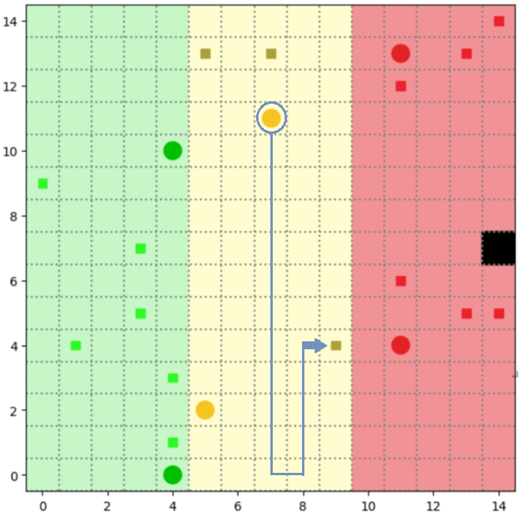

# Self-organization of Robots in a Hostile Environment  

This project simulates the mission of autonomous robots tasked with collecting, transforming, and transporting hazardous waste in a radioactive environment. The robots operate in three distinct zones, each with varying levels of radioactivity, and each robot type has specific capabilities and restrictions. This simulation uses a multi-agent system (MAS) to model collaborative behavior in a hostile environment.

## Table of Contents  

- [Project Overview](#project-overview)
- [Structure](#structure)
- [Prerequisites](#prerequisites)
- [Usage](#usage)
- [Methodology](#methodology)
- [Results](#results)
- [Limits & Improvements](#limits)
- [Contributors](#contributors)

## Project Overview

This project simulates a multi-agent system where robots cooperate to clean hazardous waste in a radioactive environment. The environment is divided into three zones based on radioactivity levels, and each type of robot has specialized tasks within these zones:

### **Zones:**

1. **Zone 1 (Low Radioactivity):** Contains green waste, accessible only to **Green Robots**.
2. **Zone 2 (Medium Radioactivity):** Contains yellow waste, accessible to **Yellow** and **Red Robots**.
3. **Zone 3 (High Radioactivity):** A storage area for fully processed waste, accessible only to **Red Robots**.

### **Key Features:**

- **Robot Types:**  
  - **Green Robots:** Collect and transform green waste into yellow waste.  
  - **Yellow Robots:** Collect and transform yellow waste into red waste.  
  - **Red Robots:** Transport red waste to the disposal zone.  

- **Agent Behaviors:**  
  - Perception, deliberation, and action cycles for autonomous decision-making.  
  - Communication capabilities between robots for improved collaboration.  

- **Visualization:**  
  - Real-time simulation with an interactive visualization to observe robot behaviors and waste processing in action.

## Structure

  - `agents.py`: Agents implementation.
  - `model.py`: Environment implementation.
  - `objects.py`: Objects implementation as inactive agents (waste/radioactivity cells...)
  - `server.py`: Contains all the necessary for running the visualisation.
  - `run.py`: Handles the launch of the simulation.
  - `metrics.py`: Implementation of monitoring metrics used to compare agent strategies.

## Prerequisites  

Ensure the following tools and libraries are installed:  

- **Python 3.11+**  
- **Required Libraries:** You will find the required packages in the [requirements.txt](#requirements.txt) file.


## Usage  

1. Clone this repository:
    ```bash
    git clone https://github.com/Malek14032000/Projet_SMA.git
    cd Projet_SMA
    ```
   
2. Install dependencies:
    ```bash
    pip install -r requirements.txt
    ```

3. Run the simulation:
    ```bash
    python run.py
    ```

4. Visualisation: 

Once the simulation starts, a browser-based visualization will automatically open to allow you to observe the robots' activities in real-time. You can set up your own configuration by modifying the parameters `number of green agents`, `number of yellow agents`, `number of red agents` and  `number of waste`. 

Pressing the **play button** will initiate the simulation. On the left side of the screen, agents begin navigating the grid, while on the right, key monitoring metrics dynamically update over time. The tracked metrics include: **the total amount of waste disposed over time**, **the amount of green waste moved**, **yellow waste moved**, and **red waste moved**. Below is a screenshot of the user interface, developed using Solora.

**TODO: mettre un screenshot de la page solora**

## Methodology

In this project, we experimented 3 strategies of agent behaviours. We will explain each one of them below and present the comparaison results in the next section.

### **Agents class inheritance**
The following UML class diagram is explains the inheritance links between all different types of agents we will present later. It is the same for the 3 strategies.
```
               Agent (mesa)
                 ↑ 
               Robot
     ↑          ↑          ↑
GreenAgent  YellowAgent  RedAgent
```
All moving agents inherent from class `Robot`, present in `agents.py` module. This class contains an argument named `strategy` that allows us to choose the strategy `1`, `2` or `3`.

### **Agents knowledge**
The `Knowledge` class, also present in `agents.py` module, represents the knowledge of an agent and its state during the simulation. Its main attributes are:

- `position`: represents the current position of the agent.
- `target_positions`: the vision of the agent of all the grid. It is a matrix size of the grid * 3, 3 as there are 3 types of waste possible. each time the agent moves, it will update this matrix with what it sees. In fact, meanwhile the other agents can pickup and transform waste. This new information will not update the matrix in this cas as the agents do not communicate.
- `my_zone`: represents the coordinates of the corners of the zone assigned to the agent. For the green/yellow/red agent, it will be a tuple of the corner coordinates of respectively the green/yellow/red zone.
- `allowed_zone`: represents the coordinates of the corners of the allowed zone for the agent. In fact, the green agent can only move in the green zone, the yellow agent can move in the green and the yellow zones, and finally the red agent can move in all 3 zones.
- `available_agents_pos`: only used when agents communicate. This allows each agent to know where the other agents, green/yellow/red, are in the grid.

### **Implemented strategies**

####  Strategy 1 : Agents with no communication, moving greedily 
In this initial approach, we adopted the following setup:

- Agents move greedily through the grid, progressing to the next column only after covering all cells in the current one.

- Agents do not communicate with each other.

- If an agent detects waste, it immediately returns to pick it up.
<p align="center">

</p>

####  Strategy 2 : Agents with communication 
This strategy builds upon the first by adding communication between agents:

- Agents still follow a greedy movement pattern.

- Communication allows agents to share information about waste locations. If one agent spots waste, all others are informed.

- Once waste is collected, all agents update their knowledge accordingly.

In this strategy, we do not deal with the case where multiple agents head to the same location. (This will be implemented in strategy 3 reducing inefficiency of agents)
<p align="center">

</p>

#### Strategy 3 : Agents with communication and coordination
This approach refines the previous one by improving coordination:

- Agents communicate waste locations just as in Strategy 2.

- The agent closest to a detected waste is assigned to retrieve it.

- If multiple agents are equidistant from the waste, a priority system based on agent ID resolves the conflict—the agent with the lowest ID takes the task, while the others seek alternatives.
<p align="center">

</p>

## Results
We ran the simulations using a `batch_size` of 3  to take into account the randomness in both waste placement and the behavior of the chosen strategy. For each configuration, we varied the number of waste items and agents per zone. Then, we ran the simulation multiple times (equal to the batch size) and computed the average time taken to fully clean the grid.

- **TODO: show table !!!**

####  Analysis of the results: 

Increasing the number of waste, increases naturally the time spent collecting the waste.

Increasing the number of agents per zone clearly reduces the time spent cleaning the grid.

We clearly see that the agent following the strategy 2 perform better thant agents following strategy 1. And agents following strategy 3 are the best among all.

####  Interpretation of the results: 

In fact, in the first strategy, agents move greedily to discover their region. So they take more time discovering their zone. As the agents do not communicate between each others, the agents in the same zone will not collaborate. Even though increasing the number of agents reduces the time spent cleaning the grid, this time reduction is not related to the implementation of strategy 1.

In the second strategy, agents communicate between each other. each one of them has an up-to-date vision of the discovered parts in the grid. So they will spend less time doing the greedy exploration, and their moves will be more targeted to closest known wastes. This way the cleaning will happen faster.

In the third strategy, agents communicate just like in strategy 2, however this time, the agents in the same zonr are able to split tasks so that two agents don't target the same waste. In this strategy, as we make sure that each agent makes the right actions for the final goal, the time qpent cleaning will decrease. However, for this strategy to show its advantage, the number of agents need to be high, so that the possibility of having two or more agents targeting the same 


## Limits & Improvements
In this project, we implemented and benchmarked three distinct behavior strategies for the agents. However, our methodology has a few limitations:

- The simulation currently operates on a grid with a fixed size and fixed regions, which limits flexibility for testing in different environments.

- Although we ran multiple simulations per configuration to reduce the variance, the overall batch size remains small, making our results not reliable enough.

- We could enhance our monitoring by introducing additional performance indicators, such as the time an agent spents not performing any useful action. This would help clarify our optimization goals — are we aiming solely for fast map cleaning, or do we also want to minimize energy/resource usage?

- In our implementation, each of the three zones contains the same amount of waste. However, this causes an imbalance since the red zone ends up being consistently overloaded compared to the others. A potential improvement would be to vary the waste density across zones and observe how it impacts the overall efficiency.

## Contributors

- Ammar Mariem
- Ben Younes Lina
- Bouhadida Malek